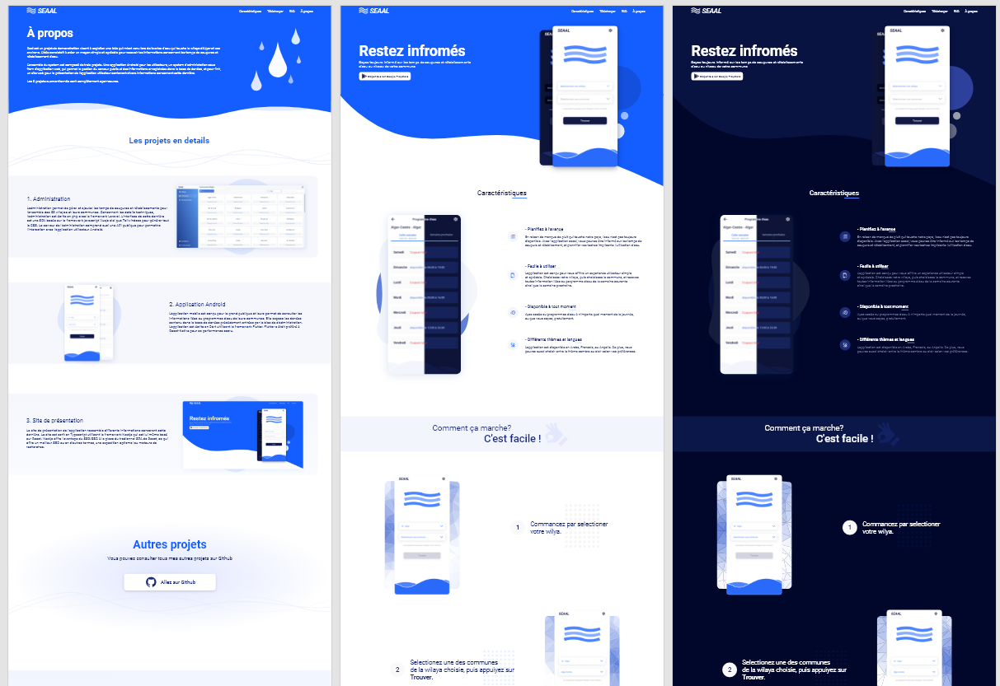

# Water Schedule App Website

This project is a website dedicated to showcase the water availablity schedules app which can be found in this [repository](https://github.com/medchek/water-schedule-app). It includes divers information regarding the phone app and its features. The website is written in typescript using [Nextjs](https://nextjs.org/) and was designed with [Adobe Xd](https://www.adobe.com/products/xd.html). It also features a dark mode and is fully responsive.

**Note:** The website and the phone app are just for demonstration purposes, however, they are also production-ready.

<p align="center">
  
</p>

## Developement

To run the development server:

```bash
npm run dev
```

Then open the borwser in [http://localhost:3000](http://localhost:3000).

## Disclaimer

The SEAAL (Société des Eaux et de l’Assainissement d’Alger) brand name is for demonstration purpose. This app is in no way endoresed by SEAAL or related to them.

## License

The app is released under the [GPL-3.0 license](https://www.gnu.org/licenses/gpl-3.0.en.html).
